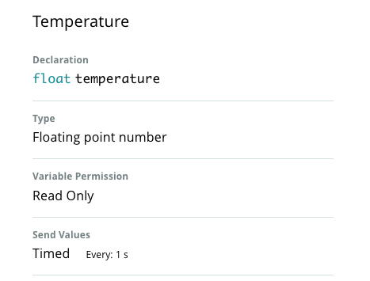
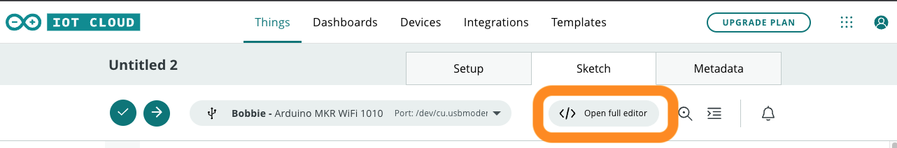
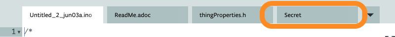
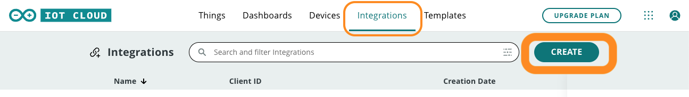
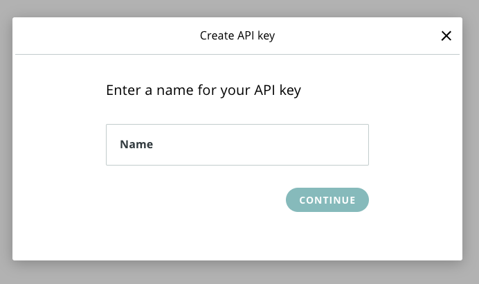
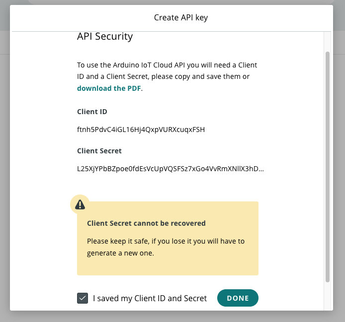
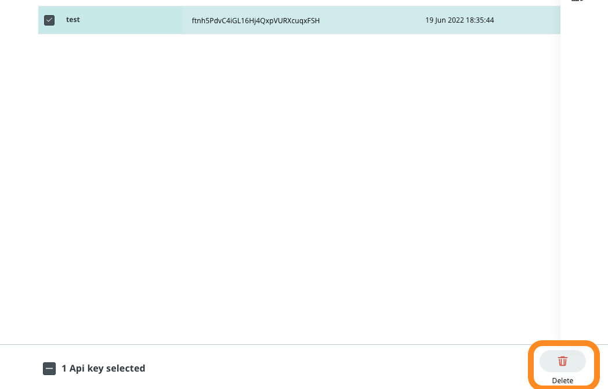
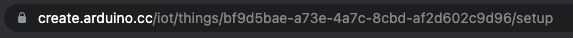
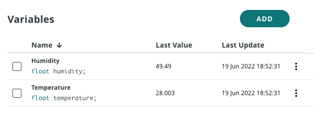

# About
These are arduino files that has been used in order to create a [Home Environment](https://github.com/pr222/home-environment) IoT project. The [carrier-display.ino](carrier-display.ino) can be used independently for the [Arduino Explore IoT Kit](https://store.arduino.cc/products/arduino-explore-iot-kit). [cloud-and-display.ino](cloud-and-display.ino) and [cloud-connection.ino](cloud-connection.ino) on the other hand are part of and dependent of a Arduino IoT Cloud sketch.

A more detailed description about the project can be found in this [tutorial](https://github.com/pr222/assignment-iot/blob/main/Tutorial.md), here will only be described the steps to get the Cloud setup running.

## Arduino IoT Cloud Setup
Start by following the [Getting Started with IoT Cloud](https://docs.arduino.cc/cloud/iot-cloud/tutorials/iot-cloud-getting-started) in order to configure the Arduino MKR 1010 controller and add your variables that you want to monitor, in the case of the Home Environment project two variables was set up. One for temperature and one for humidity, reading every 1 second. Optional is also to follow the instructions for creating a dashboard, which is quite useful to see that the sensor readings and the cloud connection is working.

Example of the temperature variable:



### Adding WiFi credentials
On your thing's page, in its its sketch-tab with the code that has been generated, you can go to "Open Full editor".



There you should be able to see the tab "Secret" and that is where you add your WiFi's login credentials.



Now you should be ready to connect the thing to the internet when uploading the code to the controller. You can also modify the file that has the standard Arduino-functions ```setup()``` and ```loop()```. In the image above, that would correspond to the tab "Untitled_2_jun03a.ino"-file. Check the [tutorial](https://github.com/pr222/assignment-iot/blob/main/Tutorial.md) for more information of how this was done for the project.

### Creating an API-key
In order to access the [Arduino Cloud's REST API](https://www.arduino.cc/reference/en/iot/api/) you need to set up an API key in the Arduino IoT Cloud that can then be used to make calls to the REST API.

Go to the "Integrations" tab and go through the steps shown in the images below. Make sure to store this information safely.





You can also delete API-keys as shown in the image below.



### ID:s for interacting with the REST API
For accessing a timeseries of data from the API you can see in their documentation how the request URL should be constructed. 

Example for [propertiesV2Timeseries](https://www.arduino.cc/reference/en/iot/api/#api-PropertiesV2-propertiesV2Timeseries):

```curl -X GET `"https://api2.arduino.cc/iot/v2/things/{id}/properties/{pid}/timeseries?desc=&from=&interval=&to="```

The id following "things" you can find most easily by visiting your thing in the Arduino Cloud and seeing its id present in the URL of the page.



The pid following "properties" is the id of the variable you have set up and want to get its readings from. Click on the variable you want to use to see its details with its pid.


### Authentication to the REST API

For each call to the API you need to provide an active JWT-access token that you can get by [Creating Auth Token](https://www.arduino.cc/reference/en/iot/api/), the token should then be used as a Bearer token in the Authorization-header for the API-requests.